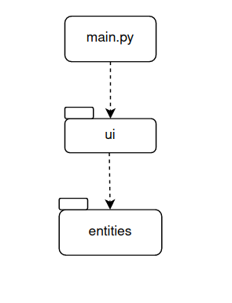

Arkkitehtuurikuvaus
=====================

Hakemistorakenne
-----------------

Ohjelma käynnistetään suorittamalla *main.py* tiedosto. Tämä luo käyttöliittymä käyttäen *ui*-pakkausta, joka taas
kutsuu edelleen *entities* pakkauksessa sijaitsevia luokkia sovelluksen toiminallisuuden toteuttamiseen. 
*Ui*-pakkaus vastaa käyttöliittymä toteutuksesta ja *entities* 
pakkauksessa sijaitsee sovelluslogiikka sekä siihen tarvittavat luokat. 

Sovelluslogiikka
----------------

Käyttöliittymä luo tarvitsemansa pelilogiikan luokasta GameLogic. Pelilogiikka taas tarvitsee toimiakseen luokkia 
Wheel, Credit ja Payoff. Wheel luokasta luodaan vaadittavat pelilinjat. Credit luokasta
luodaan pelivarat ja Payoff luokka tarkistaa voittiko pelaaja. 
