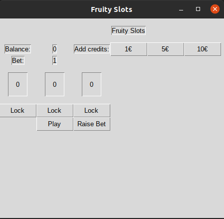
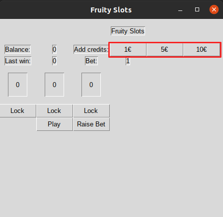
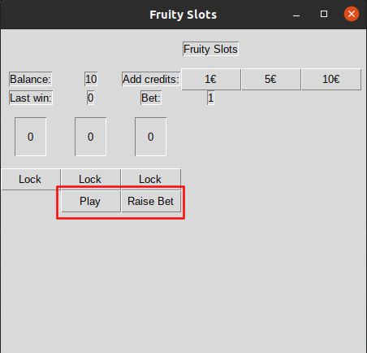
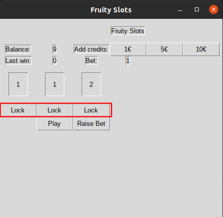

Käyttöohje
==========
Sovelluksen voi suorittaa lataamalla viimeisimmän [releasen](https://github.com/hzville/ohte-harjoitustyo-2021/releases)
Assets-osion alta.

Asennus
=======

Ohjelma tarvitsee toimiakseen ulkopuolisia riippuvuuksia. Releasen mukana on tarvittavat riippuvuudet, jotka voi asentaa
Poetry-komentorivityökalun avulla. Voit ladata Poetryn osoitteesta https://python-poetry.org/ .

Poetryn asentamisen jälkeen, saat asennettua sovelluksen riippuvuudet komenolla:
```bash
poetry install
```
Sovelluksen saa käynnistettyä komennolla:
```bash
poetry run invoke start
```
Käyttö
=======
Sovellus näyttää seuraavalta käynnistyksen jälkeen: 




Pelataksesi, lisää krediittejä painamalla "Add credits" vieressä olevia painikkeita:



Kun olet lisännyt krediittejä, voit valita panoksen ja pelata peliä painamalla "Raise Bet" ja "Play":



Kun peli on arponut kuviot pelilinjoille, voit lukita haluamasi pelilinjat painamalla "Lock"


