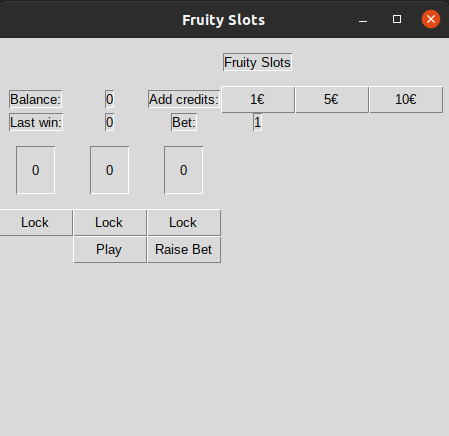

Käyttöohje
==========
Sovelluksen voi suorittaa lataamalla viimeisimmän [releasen](https://github.com/hzville/ohte-harjoitustyo-2021/releases)
Assets-osion alta.

Asennus
=======

Ohjelma tarvitsee toimiakseen ulkopuolisia riippuvuuksia. Releasen mukana on tarvittavat riippuvuudet, jotka voi asentaa
Poetry-komentorivityökalun avulla. Voit ladata Poetryn osoitteesta https://python-poetry.org/ .

Poetryn asentamisen jälkeen, saat asennettua sovelluksen riippuvuudet komenolla:
```bash
poetry install
```
Sovelluksen saa käynnistettyä komennolla:
```bash
poetry run invoke start
```
Sovelluksen käyttö
=======
Sovellus näyttää seuraavalta käynnistyksen jälkeen: 




Pelataksesi, lisää krediittejä painamalla "Add credits" vieressä olevia painikkeita:


Kun olet lisännyt krediittejä, voit valita panoksen painamalla "Raise Bet" ja pelata peliä painamalla "Play":


Kun peli on arponut numerot pelilinjoille, voit lukita haluamasi pelilinjat painamalla "Lock"


Paina uudestaan "Play" ja peli arpoo uudet numerot pelilinjoille. Jos saat kolme samanlaista numeroa, voitat pelivaroja
riippuen panoksesta ja numeroista pelilinjoilla. 

Voiton suuruus määrääntyy kaavalla (pelilinjan numero + 1) * panos.
Eli esimerkiksi jos pelilinjan numerot ovat kaikki 4 ja panoksesi on 10, voitat (4+1)*10 = 50 pelimerkkiä.
Näet viimeisimmä voiton kohdasta "Last win". Voitot lisätään automaattisesti pelivaroihin.


Tarvitset aina pelivaroja pelataksesi. Pelilinjoja voi lukita enimmillään kaksi kappaletta ja aina yhden kierroksen verran. 
Jos edellisellä kierroksella oli jokin pelilinja lukittu tai jos pelaaja voitti kyseisellä kierroksella, arpoo peli 
automaattisesti kaikille pelilinjoille uuden numeron.