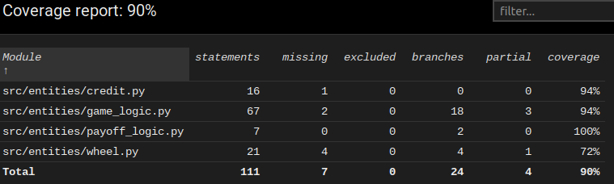

Testausdokumentti
=================
Ohjelmaa on testattu automatisoidusti yksikkötesteillä ja manuaalisesti käsin. 

Ohjelmalle on luotu yksikkötestejä unittestillä. Yksikkötestit löytyvät kansioista [src/tests](https://github.com/hzville/ohte-harjoitustyo-2021/blob/master/dokumentaatio/vaatimusmaarittely.md).
 
Yksikkötestien suoritus tapahtuu komennolla:
```bash
poetry run invoke test
```

Yksikkötestien tulokset luodaan komenolla:
```bash
poetry run invoke coverage-report
```

Komennon jälkeen yksikkötestien tulokset löytyvät htmlcov-hakemistosta. Tulokset löytyvät hakemiston sisällä tiedostosta index.html . Tiedoston index.html voit 
avata haluamallasi verkkoselaimella tai komennolla:
```bash
firefox htmlcov/index.html
```
Yksikkötestien haarautumakattavuus on 90%. 




